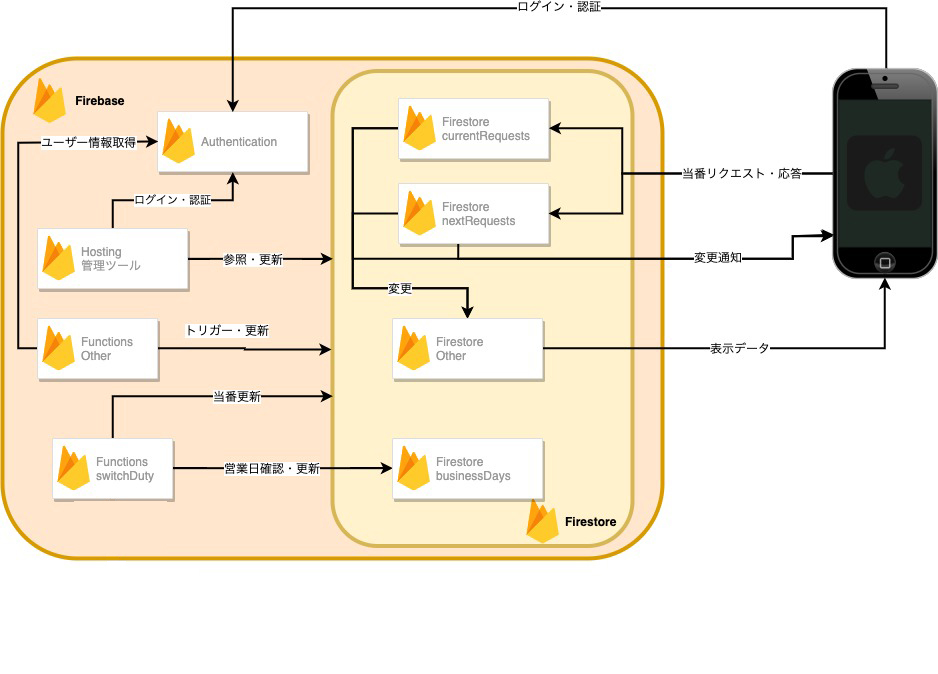

# サーバメンテ割り当てアプリBackend

> FirestoreとCloudFunctionsサーバメンテ割り当てアプリのバックエンド  

<!-- TOC -->

- [サーバメンテ割り当てアプリBackend](#サーバメンテ割り当てアプリbackend)
    - [Firebase設定](#firebase設定)
    - [ディレクトリ構成](#ディレクトリ構成)
    - [Backend構成（設計）](#backend構成設計)
        - [Firestore](#firestore)
            - [businessDays](#businessdays)
            - [departments](#departments)
            - [users](#users)
            - [lists](#lists)
            - [histories](#histories)
            - [candidates](#candidates)
            - [currents/nexts](#currentsnexts)
            - [currentRequests/nextRequests](#currentrequestsnextrequests)
            - [changedFlags](#changedflags)
        - [Cloud Functions onCall(HTTPS API)](#cloud-functions-oncallhttps-api)
            - [switchDuty](#switchduty)
            - [users](#users-1)
            - [createUser](#createuser)
            - [updateUser](#updateuser)
            - [deleteUser](#deleteuser)
        - [Cloud Functions Firestore Trigger](#cloud-functions-firestore-trigger)
            - [onCreateUserInAuthentication](#oncreateuserinauthentication)
            - [onDeleteUserInAuthentication](#ondeleteuserinauthentication)
            - [onCreateUser](#oncreateuser)
            - [onCreatedepartment](#oncreatedepartment)
            - [onCreateNext,onUpdateNext,onDeleteNext](#oncreatenextonupdatenextondeletenext)
            - [onCreateCurrent,onUpdateCurrent,onDeleteCurrent](#oncreatecurrentonupdatecurrentondeletecurrent)
            - [onCreateCurrentRequest,onUpdateCurrentRequest](#oncreatecurrentrequestonupdatecurrentrequest)
            - [onCreateNextRequest,onUpdateNextRequest](#oncreatenextrequestonupdatenextrequest)
            - [onWriteHistory](#onwritehistory)
            - [onCreateChangedFlag](#oncreatechangedflag)
        - [Storage](#storage)

<!-- /TOC -->

## Firebase設定

Firebase初期設定(Fuctions,Storage,Hosting,Firestore)   
https://firebase.google.com/docs/cli?hl=ja  

Firebaseプロジェクト  
https://console.firebase.google.com/project/employment-2020/overview  

```
$ firebase deploy
```

## ディレクトリ構成
```
public
# nuxtより生成された管理画面の静的ファイルが格納される
# backend/nuxt/README.md も参照  

functions/index.js
# デプロイ時に参照されるルートとなるファイル

functions/src/*
# index.jsから参照される各関数の実装ファイル
```

## Backend構成（設計）



### Firestore  

(cid) - departmentsのID。departmentsのドキュメント作成時にランダム生成。
(uid) - ユーザーごとの一意なID。Authenticationでのuidを使用

#### businessDays

営業日の情報を保持。  

| documentID | Field | Type | Memo |  
|----|----|----|----|
|current|timestamp|timestamp|現在の日付。00:00:00 UTC+9|
|next|timestamp|timestamp|翌営業日の日付。00:00:00 UTC+9|

#### departments

メンテの種別の情報を保持。  
(cid) - ドキュメント作成時にランダム生成。  

| documentID | Field | Type | Memo |  
|----|----|----|----|
|(cid)|name|String|メンテ種別名|
||icon|String|FirebaseStorageのicons/以下に格納されている画像名|
||priority|String|メンテの画面上での並び順 小さいほど上にくる|
||description|String|メンテの概要説明|

#### users

Authenticationでは格納できないユーザーデータを保持。  
(uid) - Authenticationでのuidと同一  

| documentID | Field | Type | Memo |  
|----|----|----|----|
|(uid)|displayName|String|表示名。Authenticationでのユーザー削除時対応|
||isActive|Boolean|メンテができるか否かを保持|
||isAdmin|Boolean|管理画面へのログイン権限があるかを保持（管理画面側での判定未実装）|

#### lists

各メンテ箇所ごと、各ユーザーごとのメンテ回数メンテの優先順位（リストの順番）を保持  

| documentID | Field | Type | Memo |  
|----|----|----|----|
|(ランダム)|department|Reference|departmentsのDocumentへの参照。|
||user|Reference|usersのDocumentへの参照。|
||count|Number|メンテ回数カウント|
||priority|Number|メンテリストの順番を決定する数値。小さいほど上にくる|

#### histories

メンテ履歴を格納。  

| documentID | Field | Type | Memo |  
|----|----|----|----|
|(ランダム)|department|Reference|departmentsのDocumentへの参照。|
||user|Reference|usersのDocumentへの参照。
||timestamp|timestamp|メンテ日時

#### candidates

メンテ当番の候補を保持。  

| documentID | Field | Type | Memo |  
|----|----|----|----|
(cid)|department|Reference|departmentsのDocumentへの参照。|
||currents|Array< Reference >|現在のメンテ候補リスト。usersのDocumentへの参照。|
||nexts|Array< Reference >|翌営業日のメンテ候補リスト。usersのDocumentへの参照。|

#### currents/nexts

現在/翌営業日のメンテ当番を保持。  

| documentID | Field | Type | Memo |  
|----|----|----|----|
|(cid)|department|Reference|departmentsのDocumentへの参照。|
||user|Reference|usersのDocumentへの参照。|

#### currentRequests/nextRequests

現在/翌営業日のメンテ当番交代リクエストを保持。  

| documentID | Field | Type | Memo |  
|----|----|----|----|
|(cid)|department|Reference|departmentsのDocumentへの参照。|
||user|Reference|リクエストを受信したusersのDocumentへの参照。|
||requestUser|Reference|リクエストを送信したusersのDocumentへの参照。|
||approval|Number|承認フラグ。0:未回答,1:許可,2:拒否|

#### changedFlags

candidatesに対する更新をトリガーする。  

### Cloud Functions onCall(HTTPS API)

https://firebase.google.com/docs/functions/callable?hl=ja


#### users

要ログイン。  
ユーザー情報を取得する。  
params: userIds Array< String > uid。空配列の場合、全件取得する。  

response:  
```
{  
    users:[
        {
            uid: ユーザーID,
            displayName: 表示名,
            email: メールアドレス,
            isAdmin: true/false,
            isActive: true/false,
            disabled: true/false # ユーザーが無効化されているとtrue
        }
    ]
}
```

#### createUser

ユーザーを作成する。  
params:  
```
{
    displayName: 表示名,
    email: メールアドレス,
    password: パスワード,
    isAdmin: true/false,
    isActive: true/false
}
```

response:  
```
user: {
    uid: ユーザーID,
    displayName: 表示名,
    email: メールアドレス,
    isAdmin: true/false,
    isActive: true/false,
    disabled: true/false # ユーザーが無効化されているとtrue
}
```

#### updateUser

ユーザー情報を更新する。  

params:  
```
{
    uid: ユーザーID,
    displayName: 表示名,
    email: メールアドレス,
    password: パスワード,
    isAdmin: true/false,
    isActive: true/false,
    disabled: true/false # ユーザーが無効化されているとtrue
}
```

response:  
```
user: {
    uid: ユーザーID,
    displayName: 表示名,
    email: メールアドレス,
    isAdmin: true/false,
    isActive: true/false,
    disabled: true/false # ユーザーが無効化されているとtrue
}
```

#### deleteUser

ユーザーを削除する。  

params:  
```
{
    uid: ユーザーID
}
```

response:  
```
{}
```

### Cloud Functions Firestore Trigger

#### onCreateUserInAuthentication

Authenticationでのユーザー作成時にFirestoreのusersにデータ書き込みを行う。  

#### onDeleteUserInAuthentication

Authenticationでのユーザー削除時にFirestoreのusersへのデータ書き込みとlistsからの削除を行う。  

#### onCreateUser

usersへのDocument追加時にlistsへのデータ追加を行う。  

#### onCreatedepartment

departmentsへのDocument追加時にlistsへのデータ追加を行う。  

#### onCreateNext,onUpdateNext,onDeleteNext

nextsへの操作時にlistsのメンテ回数更新と通知を行う。  

#### onCreateCurrent,onUpdateCurrent,onDeleteCurrent

currentsへの操作時にlistsのメンテ回数更新と通知を行う。

#### onCreateCurrentRequest,onUpdateCurrentRequest

currentRequestsへの操作時に、通知とリクエストの返答に対してのcurrentsへの更新を行う。  

#### onCreateNextRequest,onUpdateNextRequest

nextRequestsへの操作時に、通知とリクエストの返答に対してのnextsへの更新を行う。  

#### onWriteHistory

historiesの操作時にlistsのメンテ回数更新を行う。  

#### onCreateChangedFlag

changedFlagsへのDocument追加時にcandidatesの更新を行う。  

### Storage

```
icons/
メンテのアイコン

images/(cid)
メンテ区分ごとのMAP 曜日ごとに頭3文字.pngで格納
```
